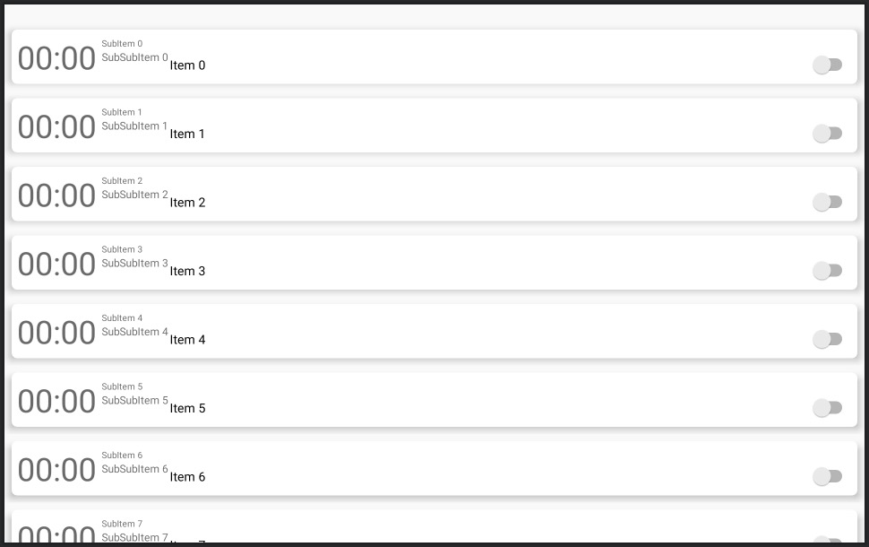

# RemindMed
# RemindMed
RemindMed saves a list of tasks or appointments for the user at a certain time, when activated the user is located at previously saved points. If the user is found, the Temi notifies the user about the scheduled activity. If the user is not located the task is delayed by one hour. 

- [App Features](https://github.com/ulygrz/RemindMed#app-features)
- [Installation Guide](https://github.com/ulygrz/RemindMed#installation-guide)
	- [Connect Computer to Robot](https://github.com/ulygrz/RemindMed#connect-computer-to-robot)
	- [Installing RemindMed](https://github.com/ulygrz/RemindMed#installing-remindmed)
	- [Uninstalling RemindMed](https://github.com/ulygrz/RemindMed#uninstalling-remindmed)
- [Functions, Parameters and Architecture](https://github.com/ulygrz/RemindMed#functions-parameters-and-architecture)
	- [Changes in the Tasks' information](https://github.com/ulygrz/RemindMed#changes-in-the-tasks-information)
	- [Information Management from the Database](https://github.com/ulygrz/RemindMed#information-management-from-the-Database)
	- [Changes in SearchUserService](https://github.com/ulygrz/RemindMed#changes-in-searchuserservice)
	- [Changes in the Menu](https://github.com/ulygrz/RemindMed#changes-in-the-menu)
	- [App Architecture](https://github.com/ulygrz/RemindMed#app-architecture)
- [Lookout](https://github.com/ulygrz/RemindMed#lookout)
- [The RemindMed App](https://github.com/ulygrz/RemindMed#the-remindmed-app)
  - [Create a New Task](https://github.com/ulygrz/RemindMed#create-a-new-task)
  - [Save Location](https://github.com/ulygrz/RemindMed#save-locations)
  - [Create a Path](https://github.com/ulygrz/RemindMed#create-a-path)
  - [Task List View](https://github.com/ulygrz/RemindMed#task-list-view)
  - [Home View](https://github.com/ulygrz/RemindMed#home-view)
  - [Task Notification](https://github.com/ulygrz/RemindMed#task-notification)

# App Features
- Save new locations directly in the app. 
- Create a search path for the user’s detection. 
- Save tasks or appointments for the user to be done at a specific time. 
- The robot navigates autonomously through the rooms.

# **Installation Guide**
The first step is to install ADB on your computer. Follow [this](https://www.xda-developers.com/install-adb-windows-macos-linux) tutorial on how to download and set up ADB on your computer.
If you are using Android Studio is most likely that it is already installed.

## Connect Computer to Robot
Once you have ADB set up on your computer, you can run your code on temi by:
**Step 1:** Make sure you are connected to the same WiFi network as the temi.
**Step 2:** On temi go to settings -> temi Developer Tools -> tap on ADB Port Opening
**Step 3:** On the computer - Using the IP address on the top right of temi’s screen you can connect to the robot and test your code. In order to establish a connection with the robot, type the following command in Terminal on Mac or Command Prompt on Windows.

```sh
adb connect <IP_ADDRESS>:5555
```

## Installing RemindMed
Once you have established a connection between your computer and temi, you can install your app using two methods:

**1.** Directly through Android Studio by selecting the "rockchip rk****" and selecting Run.
**2.** By typing the following in the command line:

```sh
adb install [option] PATH_OF_APK
```

## Uninstalling RemindMed
Once you have established a connection between your computer and temi, you can uninstall your app on temi by typing the following in the terminal:

```sh
abd uninstall [option] PACKAGE_NAME
```

# Functions, Parameters and Architecture
## Changes in the Tasks' information
In order to add or change the Information requested for new tasks, the changes have to be done in the class Task.  
The parameters of Task are: taskId, hour, minute, taskName, created, started, recurring, Monday, Tuesday, Wednesday, Thursday, Friday, Saturday, Sunday and taskInfo. 
The class has get-functions for the parameters above. 
It also has the functions schedule() to set the task at the selected time and day, cancelTask() to cancel the activation of the task. Finally, getRecurringDayText() set as text the days on which the task will be triggered.

## Information Management from the Database
The tasks saved in the database can be accessed and changed through the ViewModel-Classes: TaskViewModel and CreateTaskViewModel. 
TaskViewModel has the following methods: update, insert, delete, deleteAllTask, getAllTask. 
CreateTaskViewModel can only save new Tasks in the TaskDatabase, therefore it only has the method insert. 

## Changes in SearchUserService 
SearchUserService will be triggered by TaskBroadcastReceiver through the method startTaskService() when the starting time of a saved and active Task has come. 
This service will look for the patient in the selected locations in the path. In each location, it will turn 360 grads searching for a person. If no one is detected, then the robot navigates to the next location. If it finds someone, it will go next to the person and notify him/her about the task of the appointment. Through NotificationsActivity the robot can stay with the person or return to the docking station. 
If at the end of the path no one could be found, then the robot will go back to the docking station and reschedule the task and the search for one hour later. 

This service has the following methods:

| Method | Description |
| ------ | ------ |
| startDetection | It requests permission for detection and starts the search process in the first location on the path.  |
| detecting | This method is called when the robot arrives at a location in the path. It calls turnBy() to turn the robot 45 degrees while nobody is detected until it has rotated 360 degrees. After this process, the robot calls goTo() to go to the next location in the path, if no one is detected. |
| turnBy | This method turns the robot 45 degrees |
| goTo | This method moves the temi to the selected location on the path |
| requestPermissionIfNeeded | It requires the permissions and checks, if these are granted  |
| interacting | It is called when the user is interacting with the robot, stops the movement and set turn the detection mode off  |
| rescheduleTask | This method reschedules the task one hour later if nobody was found in the search process | 
| onUserInteraction | This method is a listener from Temi’s SDK and it will be called when the user touches the display. It calls the method of interacting. | 
| onDetectionStateChanged | This method is a listener from Temi’s SDK and receives the detection's state. If a person is detected, the Temi tells “Hallo, du hast ein gespeichertes Ereignis”, it also starts the class NotificationActivity and ends the service SearchingUserService | 
| onGoToLocationStatusChanged| This method is a listener from Temi’s SDK. It checks if the robot arrived at the selected location. When the robot arrived at the location it calls detecting(), also when the robot arrives at home base (docking station) it calls rescheduleTask() | 

## Changes in the Menu  

The class **Path** checks when started, if it exists already a path and displays it. It is done in getSavedPath and onCreateView with the variable savedPath.
It allows selecting all the locations except for “home base” (docking station). 
Its method savePath() saves the path in SharedPreferences. 
 
**HomeFragment** shows the next scheduled task, through its method getNextTask(). 

## App Architecture
The app is based on a MVVM-Pattern and it has the following structure: 


 
The databases are managed and accessed through Repository and DAO patterns. The Repository uses DAO to fetch data from the Databases and populate a domain object (I found it so, but I mean the database) 
In Task the TaskFragment uses TaskRecyclerViewAdapter and TaskViewHolder to display the notes for the patients as a List. 
TaskFragment can update, delete and see all the saved tasks through TaskViewModel. 
AddNewTaskFragment saves new tasks via CreateNewTaskViewModel.  
TaskViewModel will be used also by RescheduleTaskService. This Service reschedules the active tasks saved in the database after the robot has been turned on. 
TaskBroadcasReceiver receives from the system the action to start the  SerchingUserService 

# Lookout

## _Current Status:_

The app allows you to save tasks and these are activated at the specified time. When searching for the patient, the app navigates the robot as set in the path. At the end of the path, the robot automatically returns to the docking station and reschedules the reminder. The robot is able to detect and follow the patient, and then display the notification to the patient.

## _Open Issues:_

The app has issues showing the next task in the HomeFragment. 

# The RemindMed App

## Create a New Task
 Press the + button (shown on the left) on the bottom menu bar to save a new task.
Then the fragment under will open. To repeat the task on weekdays check the box “Wiederholen” and then select the days on which the task will be repeated.


## Save Locations

 To save new locations directly in the app, press the button with the symbol shown on the left. Then on the fragment shown below click on “+” then a field to edit text will appear.
Write the name of the new location and press the “ok” button to save it.


## Create a Path
 In order to navigate through the room, the robot needs a path to follow. The path is made up of the places selected from the list of places saved in TemiOS.
To create a new path, click on the “+” button and select the locations from the spinner, that appear in the blue marked area. It will display a list of the locations selected for the path.
To save the path click on the green marked button.
If you want to create a new path, clear the existing path with the red marked refresh button.


## Task List View
 To see and manage the scheduled tasks click on the menu button shown on the left. 
The tasks list will display as shown in the picture below. To activate or deactivate the tasks move the switch (marked in red)
To delete a task, swipe it to the side



## Home View
 To access the home view, select the button on the menu bar shown on the left.
The home view should show the name and the recurring days of the following task


## Task notification
When the patient was found the following notifications and activity will be displayed. It shows the task name and its attached information.
Click on “Bestätigen” to let the robot stay in its current location. To send the robot to the docking station click on “Kehrt zurück zur Basisstation”


